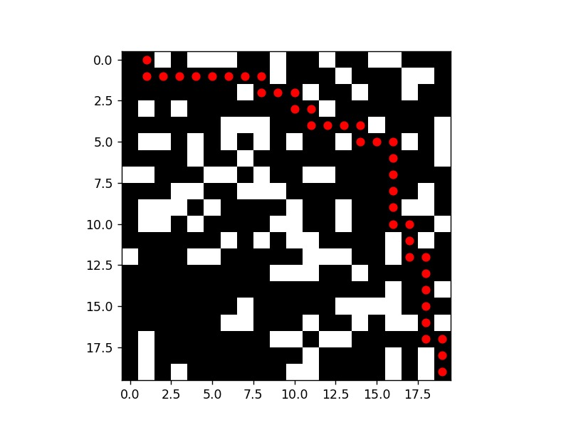

# Algoritmo A* - Labirinto



> O algoritmo A* é utilizado para encontrar o caminho mais curto entre dois pontos em um labirinto, levando em consideração obstáculos e a distância heurística. Este projeto foi desenvolvido em Python e usa bibliotecas como `numpy` e `matplotlib` para gerar e visualizar o labirinto.

## 💻 Pré-requisitos

Antes de começar, verifique se você atendeu aos seguintes requisitos:

- Você instalou a versão mais recente do Python (preferencialmente 3.x)
- Você tem uma máquina com Windows, Linux ou macOS.
- Você possui as bibliotecas `numpy` e `matplotlib` instaladas. Você pode instalá-las usando o seguinte comando:

```
pip install numpy matplotlib
```

## 🚀 Instalando Algoritmo A*

Para instalar o projeto, siga estas etapas:

### Linux e macOS:

Clone o repositório:

```
git clone https://github.com/usuario/projeto-a-star.git
cd projeto-a-star
```

### Windows:

Clone o repositório:

```
git clone https://github.com/giclocate/mazen-algorithm.git
cd mazen.py
```

Instale as dependências necessárias:

```
pip install numpy matplotlib
```

## ☕ Usando Algoritmo A*

Para usar o projeto, siga estas etapas:

1. Execute o código:

```
python mazen.py
```

2. O programa irá gerar um labirinto aleatório e exibir a solução encontrada pelo algoritmo A*.

## 🤝 Colaboradores

Agradecemos às seguintes pessoas que contribuíram para este projeto:

<table>
  <tr>
    <td align="center">
      <a href="https://github.com/giclocate" title="Usuário">
        <br>
        <sub>
          <b>Giovanna Clócate</b>
        </sub>
      </a>
    </td>
  </tr>
</table>

## 📝 Licença

Esse projeto está sob licença MIT. Veja o arquivo [LICENÇA](LICENSE.md) para mais detalhes.
